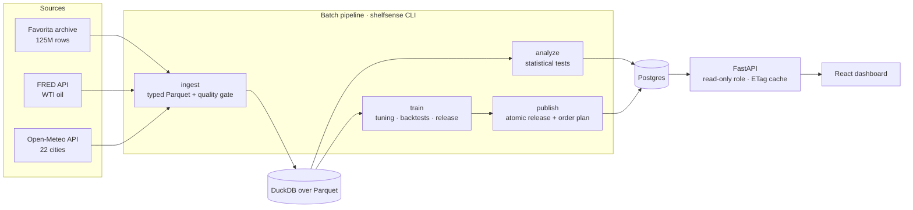

# ShelfSense

Demand forecasting and replenishment planning for grocery retail.

ShelfSense forecasts daily unit sales 16 days ahead for **218,470 store-items** across
54 stores of Corporación Favorita (Ecuador). It then turns those forecasts into order
quantities that balance lost sales against waste. The pipeline is a set of CLI stages:
ingest, analyze, train and publish. Results are served by a read-only FastAPI service
backed by Postgres and shown in a React dashboard.

## Results

All scores come from **rolling-origin backtests**: each model trains only on data
before a fold's first day, then forecasts the next 16 days. The folds start on
2017-07-12 and 2017-07-26, and the numbers below are the mean over both.

### Store-item forecasts (218,470 series)

| Model | NWRMSLE ↓ | WAPE ↓ | Bias |
|---|---|---|---|
| **Ensemble (LightGBM + embedding network)** | **0.5153** | **51.6%** | −20.4% |
| Entity-embedding network (PyTorch) | 0.5178 | 52.0% | −18.8% |
| LightGBM, one model per forecast day | 0.5181 | 52.1% | −21.4% |
| 14-day moving average | 0.5830 | 58.7% | −17.1% |
| Same-weekday 4-week average | 0.6019 | 57.3% | −14.5% |

- NWRMSLE is the competition metric (perishables weigh 1.25). The ensemble cuts it by
  **11.6%** against the moving average.
- The ensemble's lead over every single model is significant. A Diebold-Mariano test
  gives p ≤ 0.002. A 300-resample bootstrap over series gives a 95% interval for the
  ensemble-minus-LightGBM gap of [−0.0040, −0.0036].
- The blend weights were fitted on a held-out window: 0.50 network, 0.48 LightGBM,
  0.02 moving average.
- Split-conformal 80% intervals cover **82.3%** of actual values on the later fold, after
  calibrating on the earlier one.
- Hyperparameters come from Optuna (TPE, median pruning). The search used only data
  that ends before the first backtest fold.

### Store × family forecasts (1,837 series across national, store and store-family levels)

| Model | RMSLE ↓ | WAPE ↓ | MASE ↓ | 80% coverage |
|---|---|---|---|---|
| **Chronos-2, fine-tuned on Favorita** | **0.409** | **12.2%** | 0.852 | 79.8% |
| Chronos-2, zero-shot | 0.417 | 12.4% | 0.845 | 77.7% |
| Mean of ETS, ARIMA, N-BEATS, TFT | 0.436 | 13.5% | 0.907 | – |
| TFT (with planned promotions) | 0.446 | 18.4% | 1.024 | 82.3% |
| N-BEATS | 0.448 | 12.9% | 0.881 | 80.0% |
| Item ensemble summed to store-family | 0.464 | 22.3% | 1.110 | – |
| ETS | 0.475 | 14.3% | 0.984 | 89.3% |
| ARIMA | 0.480 | 15.7% | 0.986 | 88.9% |
| Seasonal naive | 0.564 | 16.5% | 1.112 | 92.1% |

- Fine-tuning the pretrained foundation model gave the best store-family accuracy.
  It beat its own zero-shot version by 2.1% RMSLE and ETS by 14%.
- MinTrace reconciliation (WLS-structural, non-negative) made the forecasts add up
  across levels. However, it raised RMSLE to 0.766 while WAPE stayed at 13.7%. The
  damage is concentrated in low-volume store-families that the non-negativity
  constraint pushes to zero. For that reason the dashboard shows the reconciled
  forecast only for totals.

### Ordering decisions

The policies were replayed against actual demand on the latest fold.
- Perishables are ordered daily. A unit short costs its margin (0.30 of price) and a
  unit left over is written off (0.50).
- Shelf-stable goods are ordered weekly. A unit left over costs holding (0.03).

| Policy | Fill rate | Units short | Units left over | Mismatch cost |
|---|---|---|---|---|
| Order the 14-day average | 65.7% | 4.39M | 1.32M | 1.69M |
| Order the median forecast | 69.1% | 3.96M | 1.04M | 1.50M |
| **Newsvendor (critical-ratio quantile)** | **81.5%** | **2.37M** | 5.14M | **1.05M (−38%)** |

- Shelf-stable cost fell 56% because cheap holding justifies a 91% in-stock target.
- Perishable cost fell 17% with a deliberately lower 38% target, since waste costs more
  than a lost margin.
- Favorita publishes no prices, so costs are in shelf-price units. Recorded sales
  understate demand when shelves ran empty, so the lost-sale figures are conservative.

### What drives demand

These findings come from `shelfsense analyze`. Effects are percent changes with 95% intervals.

- **Weekly pattern:** Sunday is +38% and Saturday +25% against an average day;
  Thursday is −20%. December is +23%. MSTL strengths are 0.35 weekly, 0.35 yearly and
  0.60 trend.
- **Promotions:** a within-series two-way fixed-effects estimate, with errors clustered
  by store-item, gives a median lift of +44% across 19 families (17 significant).
  The range runs from Home & Kitchen II (+102%) to Poultry (−18%).
- **Calendar events:** the regression uses Newey-West errors and has R² 0.63.
  - Additional holidays add +20% (9 to 31%), bridge days +20% (5 to 37%) and
    transferred holidays +25% (7 to 45%).
  - The April 2016 earthquake relief period added +24% (11 to 39%).
  - Payday has no detectable effect (+1.4%, p = 0.28).
- **Weather:** heavy rain (10 mm or more) has no effect on store transactions
  (p = 0.86). Store and date fixed effects compare cities on the same day.
- **Oil:** the WTI price does not Granger-cause weekly sales growth at 1–4 week lags
  (p = 0.40), so it was left out of the models on that evidence.
- **Stationarity:** log sales are non-stationary and their daily change is stationary
  (ADF and KPSS agree).

## Architecture



The design separates offline and online work. Heavy work runs offline in batch. The
API only reads a finished, immutable **release**, so requests are fast and cheap.

- **Releases:** publishing writes a complete release in one transaction, then flips a
  single `is_current` flag. A partial unique index guarantees exactly one current
  release. Readers never see a half-written release, and old releases are pruned.
- **Caching:** every response carries an ETag derived from the release id, and an
  in-process TTL cache is keyed by it. A new release invalidates everything without
  explicit purges, and unchanged data answers `304`.
- **Least privilege:** the API connects as a member of the `api_readonly` role, which
  a migration creates. The service has GET-only CORS for configured origins, security
  headers and request ids on every response.
- **Quality gate:** ingestion runs 15 checks covering key uniqueness, referential
  integrity, duplicates, calendar gaps and source agreement. Errors stop the pipeline,
  and warnings are recorded and shown in the dashboard.
- **No hard-coded values:** every URL, path, key and model id is a required setting
  that is validated at start-up. Only operational tunables have documented defaults
  (see `backend/.env.example`).

Design patterns in use:

| Pattern | Where it's used |
|---|---|
| Strategy | Every item model implements `ItemForecaster` (`fit`, `predict`) |
| Registry / factory | Models are chosen by name in config (`forecasting/registry.py`) |
| Repository | Write-side `storage/repositories.py`, read-side `api/queries.py` |
| Adapter | One client per upstream API, with retries, `Retry-After` handling and stall-aware resumable downloads |
| Template method | Each training level follows tune → backtest → calibrate → release → persist |
| Dependency injection | FastAPI dependencies supply the session, settings and current release |

## Tech stack

All of it is free and open source.

| Layer | Tools |
|---|---|
| Data | DuckDB, Parquet, Polars, PostgreSQL 17/18, SQLAlchemy 2, Alembic |
| Statistics | statsmodels (MSTL, ADF/KPSS, HAC OLS, Granger), custom two-way fixed-effects estimator |
| Machine learning | LightGBM, Optuna, statsforecast (ETS, ARIMA), hierarchicalforecast (MinTrace) |
| Deep learning | PyTorch entity-embedding network, N-BEATS, TFT (neuralforecast), Chronos-2 (fine-tuned) |
| Serving | FastAPI, Uvicorn, Docker |
| Frontend | React 19, TypeScript, Vite, Tailwind CSS 4, ECharts, TanStack Query |
| Quality | Ruff, mypy (strict), pytest (unit + Postgres integration), GitHub Actions |

## Repository layout

```
backend/app/
  ingestion/     Favorita archive, FRED, Open-Meteo, quality gate
  storage/       catalog, DuckDB warehouse, Postgres models and repositories
  analysis/      decomposition, stationarity, causal effect estimates
  features/      panel, calendar and weather context, leakage-safe windows
  forecasting/   baselines, LightGBM, embedding network, tuning, family hierarchy, Chronos-2
  evaluation/    metrics, Diebold-Mariano, cluster bootstrap
  inventory/     newsvendor ordering and policy replay
  pipelines/     ingestion, analysis, training, publishing
  api/           FastAPI app, routes, queries, cache, middleware
backend/migrations/   Alembic
backend/tests/        unit and integration tests
frontend/src/         dashboard (overview, explorer, store and family, orders, models, drivers)
deploy/               API container
```

## Running it

You need Python 3.12 with [uv](https://docs.astral.sh/uv/), Node 24 and PostgreSQL.
A free FRED API key is also required; Open-Meteo needs none.

```bash
cd backend
cp .env.example .env            # fill in every value
uv sync
uv run alembic upgrade head
uv run shelfsense check-config  # validates settings without printing them
uv run shelfsense pipeline      # ingest -> analyze -> train -> publish
uv run uvicorn --factory app.api.main:create_app --port 8000

cd ../frontend
cp .env.example .env            # VITE_API_BASE_URL=http://localhost:8000/api
npm ci && npm run dev
```

The full pipeline took about 7 hours of compute on an 8-core laptop CPU without a GPU.
Most of that time was LightGBM over 1.7M training rows × 94 features × 16 horizons,
plus AutoARIMA over 1,837 series. Every stage can also be run on its own:
`ingest`, `analyze`, `train`, `publish`.

Tests:

```bash
uv run pytest                                  # unit tests
TEST_DATABASE_URL=postgresql://... uv run pytest   # adds the Postgres integration tests
```

## Deployment

- **API:** `deploy/api.Dockerfile` builds a slim, non-root image with no training
  libraries. `render.yaml` deploys it on Render's free tier.
- **Database:** any Postgres, for example Neon's free tier. Run
  `alembic upgrade head` and `shelfsense publish` against it. Then create a login role
  in `api_readonly` for the API.
- **Dashboard:** `.github/workflows/pages.yml` publishes to GitHub Pages once the
  repository variable `SHELFSENSE_API_URL` is set.

## Notes and limits

- **Data source:** the 2017 Favorita competition files come from a public mirror of
  the original archive. Weather comes from ERA5 reanalysis.
- **Hold-out period:** the competition's own test period has no public labels, so
  accuracy is measured on backtest folds from the last weeks of training data. The
  leaderboard's top private scores were around 0.51 NWRMSLE on that hidden period,
  so they are a reference point, not a direct comparison.
- **Missing promotions:** promotion flags are unknown for 21.7M early rows, and
  zero-sale days have no promotion record. Promotion effects are therefore estimated
  only on densely selling series to limit selection bias.
- **Hardware:** the deep models trained on CPU. The store-family neural models use
  800 training steps.
